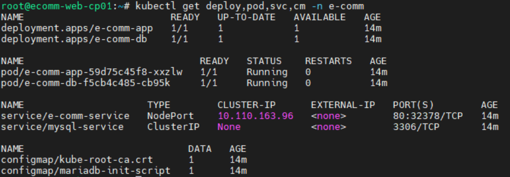
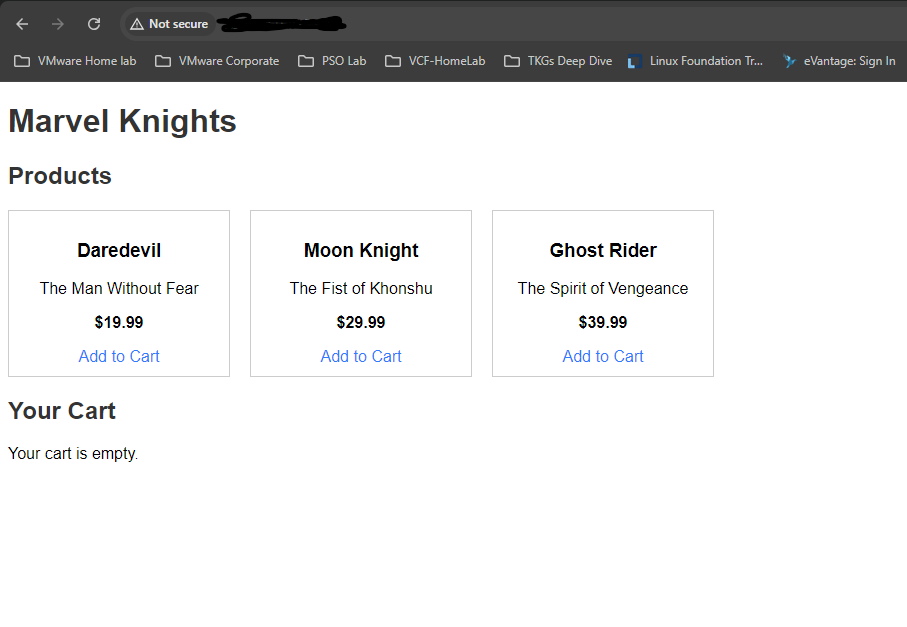
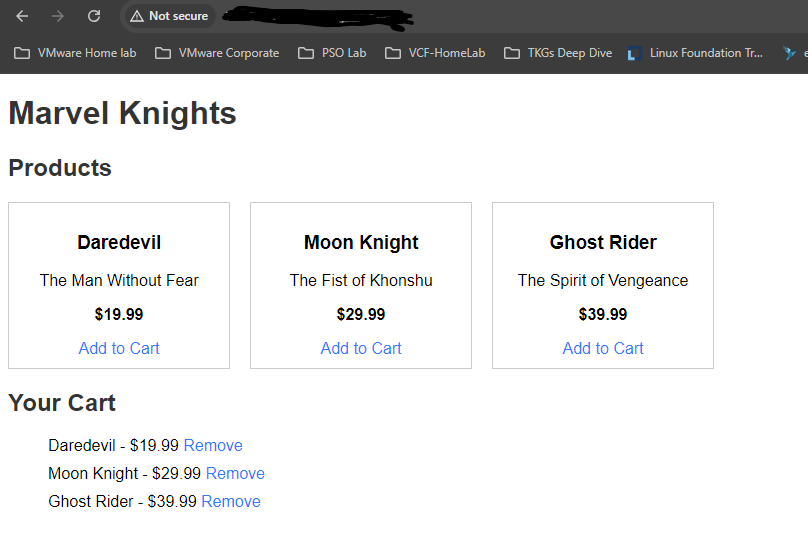

# Web App Deployment in Kubernetes (K8s) Cluster

A Project to simulate a deployment of a E-Commerce Website on a Kubernetes Cluster.

# Goals

To test my proficiency in Kubernetes and containerization, demonstrating the ability to deploy, scale, and manage web applications efficiently in a K8s environment, underscoring cloud-native deployment skills.

#  Process

The overall flow into implementing my project is as follows:

## 1. Containerize my E-Commerce Website and Database

To get started, I firstly prepared the source code for the e-commerce website application using PHP. It’s simplified to demonstrate how PHP works with MySQL to manage products, a cart, and orders.

The project structure will be:

src/

├── index.php

├── config.php

├── db.php

├── cart.php

└── style.css

I then created a Dockerfile with the following instructions:
   - Use `php:7.4-apache` as the base image.
   - Install `mysqli` extension for PHP.
   - Copy the application source code to `/var/www/html/`.
   - Update database connection strings to point to a Kubernetes service named `mysql-service`.
   - Expose port `80` to allow traffic to the web server.

I then created a new Docker image using the Dockerfile by running the command:

> $ docker build -t bryanlieu/ecomm-web .

I then pushed the newly created Docker image onto my Docker Hub repository:

> $ docker push bryanlieu/ecomm-web

If pushing the image fails with the error `denied: requested access to the resource is denied` , remember to login to the Docker Hub registry with the account credentials first:

> $ docker login docker.io -u bryanlieu -p ******

Instead of containerizing the database, I instead prepared a database initialization script (`db-load-script.sql`) to be used with Kubernetes ConfigMaps and the official MariaDB image. The script sets up the database schema and populate any necessary data (e.g., tables, relationships).

Database Name: The database is named `ecommerce`, as specified in the `config.php`.

Tables: I added the tables users, products, orders, and order_items to support a basic e-commerce schema.
- users table: Stores user information like username, email, and password.
- products table: Stores product information.
- orders table: Tracks orders, linking them to users via a foreign key.
- order_items table: Tracks individual items in orders, linking them to products and orders.

Initial Data:
- Insert a default admin user (admin) with a hashed password (MD5('password')).
- Insert sample products into the products table.

## 2. Set Up a Kubernetes Cluster

**Cluster Creation**: As I already have a [Home Lab environment running on vSphere 7](https://github.com/Bryan-LJX/homelab), I deployed my cluster on 3 ubuntu virtual machines in my lab. There are many k8s installation scripts out there, the one I used is from [killer-sh's cks course.](https://github.com/killer-sh/cks-course-environment/tree/master/cluster-setup/latest)

**Outcome**: A fully operational Kubernetes cluster ready for deployment:

> root@ecomm-web-cp01:~# kubectl get no

> NAME &emsp; &emsp; &emsp; &emsp; &emsp; &emsp; &ensp; STATUS &ensp; ROLES &emsp; &emsp; &emsp; &ensp; AGE &emsp; VERSION

> ecomm-web-cp01    &emsp; &emsp; &ensp;   Ready  &emsp;  control-plane  &emsp; 63m  &emsp;   v1.30.5

> ecomm-web-worker01 &emsp;   Ready &emsp;   none &emsp; &emsp; &emsp; &ensp;  &nbsp;      14m  &emsp;   v1.30.5

> ecomm-web-worker02  &emsp; Ready  &emsp;  none    &emsp; &emsp; &emsp; &ensp;  &nbsp;     2m33s &emsp;  v1.30.5

## 3. Deploy my Website to Kubernetes and expose it

**Kubernetes Deployment**: Created a `deploy.yaml` manifest which consists of the following:

- A ConfigMap named `mariadb-init-script` containing my SQL initialization script `db-load-script.sql`
- A Deployment manifest using MariaDB named `e-comm-db`, with the ConfigMap `mariadb-init-script` mounted to the container at /docker-entrypoint-initdb.d/
- A Service named `mysql-service` whcih exposes the `e-comm-db` deployment via port 3306. The service name must tally with the DB_NAME variable defined in the original `config.php` file.
- A Deployment named `e-comm-app`using the Dockerfile `ecomm-web` image I created and pushed to my Docker Hub registry earlier.
- Finally, to expose the e-commerce website (PHP application), I created a Service resource named `e-comm-service` to map external traffic to the pod. As my k8s cluster is not on a Cloud Environment, I used the NodePort servicetype instead of LoadBalancer.

To deploy the e-commerce website application, simply run the command:

> root@ecomm-web-cp01:~# kubectl apply -f deploy.yaml

The following resources are deployed in my cluster after running the command:

## 4. Results

I was successfully able to access my e-commerce website application by navigating to the cluster's worker node IP address + NodePort number on a web browser.

To obtain info on the worker node IP & port number, run the following command on the k8s cluster:

> root@ecomm-web-cp01:~# kubectl get pod,svc -n e-comm -o wide

The worker node where the e-comm-app pod is deployed on can be seen from the command output, as well as the NodePort number.

On the web browser, the 3 catalog items from the database deployment can be seen without any issues:

The original source code also features a cart function where I was successfully able to add & remove the 3 catalog items into my cart:

# Future

- Add a feature toggle to the web application to enable a "dark mode" for the website.
- Scaling the Application
- Perform Rolling Updates
- Roll Back the Deployment
- Autoscale the Application
- Implement Liveness and Readiness Probes
- Utilize ConfigMaps and Secrets

# Resources

- [Cloud Resume Challenge GitHub documentation](https://github.com/cloudresumechallenge/projects/blob/main/projects/kubernetes/cloud-resume-challenge.md)
